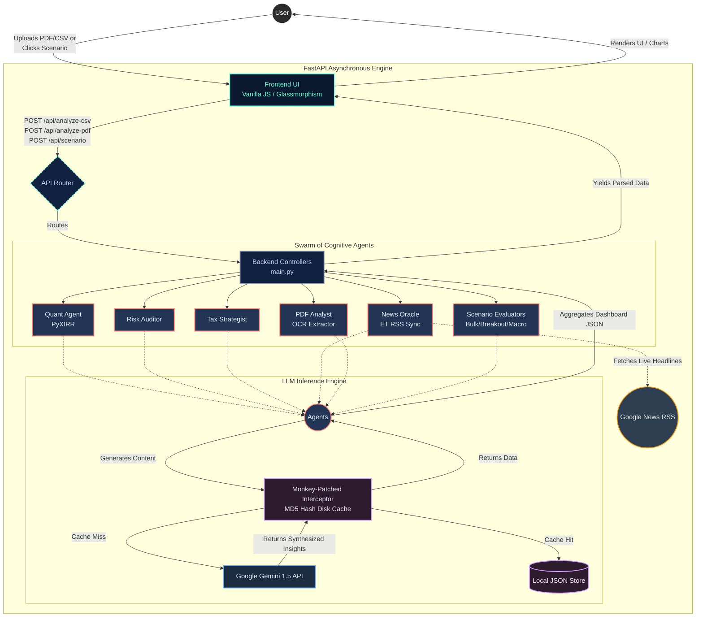

# 🏛️ Alpha-Hunter: System Architecture

This document provides a high-level overview of the data flow, the autonomous agent grid, and the technological stack powering **Alpha-Hunter**. 

## High-Level Data Flow

At its core, **Alpha-Hunter** operates on a modern decoupled architecture. The user interface acts as a thin, highly responsive client that offloads all heavy analytical lifting to an asynchronous Python engine. 

1. **Ingestion Layer:** The user interacts with the Glassmorphism UI, dropping unstructured data (like messy PDFs) or structural ledgers (CSVs) into the application.
2. **Routing & Dispatch:** The Vanilla JS frontend sends POST requests payloading the data to the FastAPI router.
3. **The Cognitive Swarm:** 
    - The backend parses the data and awakens a suite of distinct Python scripts (the "Agents"), each responsible for a specific domain (Quant, Risk, Tax, NLP Extraction, Scenarios, and Live News).
    - These agents simultaneously synthesize the data using algorithmic methods (e.g., PyXIRR for mathematical returns) and generative methods (e.g., Google's Gemini 1.5).
4. **Resilience & Caching:** To guarantee high availability and protect against API Quota Exhaustion (`429 Too Many Requests`), a custom monkey-patched middleware sits between the Agents and Google's LLM. This caches exact prompt hashes to a local `.gemini_cache` disk store, serving repeat queries instantly holding API costs to an absolute minimum.
5. **Presentation:** The aggregated insights are packaged into a structured JSON response to the frontend, instantly expanding the visual dashboard.

---

## 🏗️ Architecture Diagram

---

## 🛡️ Security & Scalability

- **API Protection:** The local MD5-hash cache intercepts backend inference generation globally. Identical AI evaluations cost $0 and take 0ms after the first request.
- **Data Privacy:** Local `pandas` dataframes and `.env` isolation ensures the user's base brokerage data and developer keys never leak beyond their designated execution loop.
- **Asynchronous Design:** Leveraging FastAPI and Uvicorn thread-pooling ensures that waiting for the LLM to write a "Risk Strategy" does not freeze the UI or block concurrent user operations.
